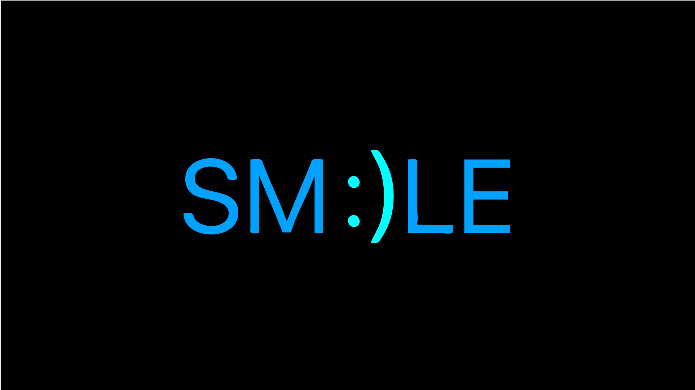

</img>

- 👋 Hi, I’m @Cosmic-Chimp aka Rueben
- 📘 I’m currently learning about code through CodeCademy's Full-Stack Engineer Path
- 🧠 I’m always happy to learn new things and I'm super excited about how the tech world is progressing
- 📫 Contact me by my e-mail: ... (currently havent gotten my own professional e-mail,but i'll have it real soon)
- 👀 I’m interested in improving my life aswell as other people's lives through the use of technology
- 🥅 My goal for this year is to become better with JavaScript,SASS and Node.js
- 🕹️ Fun fact about me: I love gaming and plan on making my own platform game somewhere in the future

 

  
 Languages and Tools that I use 🛠:
 
   
  <code></code>
  <code></code>
  <code></code>
  <code></code>
  <code></code>
  <code></code>
  <code></code>
  <code></code>
  <code></code>

  

 Connect with me🤝: 

 

<!--  -->

 
